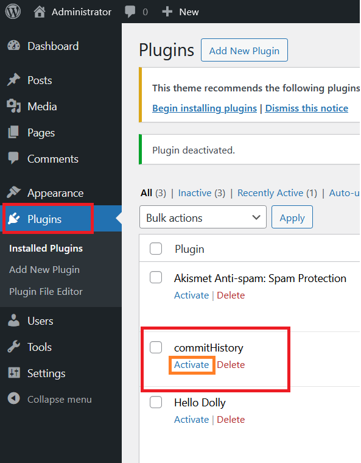
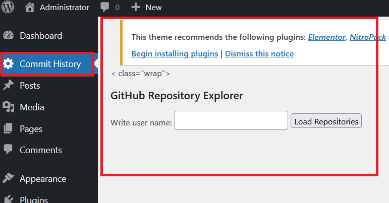
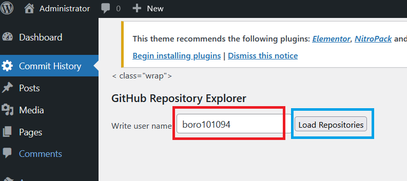
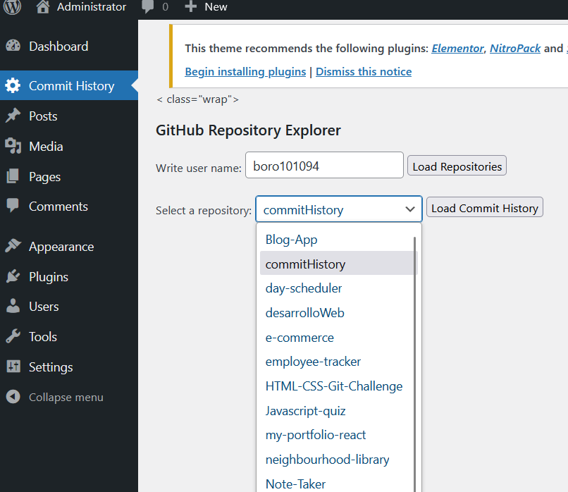
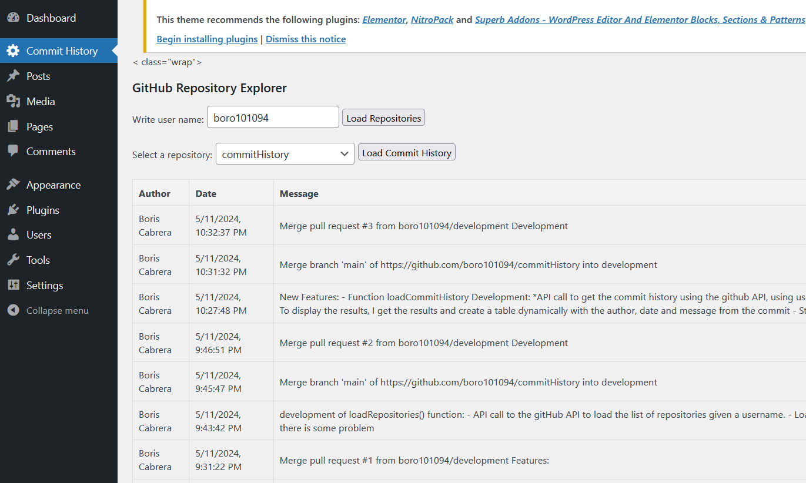

# Commit History GitHub

## Description
This Wordpress plugin will let the person to get a list of all the commits made in a repository

## Installation

Download the folder and place it in  ./wp-content/plugins inside your wordpress installation.

Afer copying the folder, in our wordpress dashboard on the plugin option we should see our new plugin in the list.

We have to click on "Activate".

After clicking "Activate" we will see a new option in the dashboard "Commit History".

## Usage

To use the plugin we will need the username to retireve all the public repositories of the user:

We can find the user name:

Back on our wordpress we type the user name in the input to get all teh public repositories:

Then we click on "Load Repositories", and a new combo box will appear with a list of all the public repositories of the user.

After selecting the respository wich we want to get the commit hisotry we click on "Load Commit History", and we will see a table with all the commits.

## Contact Information

    GitHub: boro101094
    Email: boro101094@gmail.com